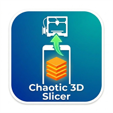

<p align="center">
  
</p>

<h1 align="center">Chaotic 3D Slicer</h1>

<p align="center">
  <b>Slice and print from your phone.</b><br/>
  A self-hosted mobile slicer for the Elegoo Centauri Carbon, Centauri Carbon&nbsp;2 (incl. 4-colour Canvas painting) and Bambu&nbsp;Lab printers — powered by the real ElegooSlicer/OrcaSlicer engine running on your own PC.
</p>

<p align="center">
  <a href="https://github.com/Dracon420/chaotic-3d-slicer/releases/latest"><b>⬇&nbsp; Download the latest release</b></a>
  &nbsp;·&nbsp;
  <a href="https://github.com/Dracon420/chaotic-3d-slicer/releases/latest"></a>
</p>

<p align="center"><sub>Grab the <b>portable .zip</b> (extract &amp; run — no install) or the <code>.exe</code> installer. The build is unsigned, so Windows SmartScreen may warn — see <a href="#windows-says-its-a-virus--smartscreen-blocked-it">the note below</a>.</sub></p>

---

## What it does

Your Windows PC runs a small tray app (like Docker Desktop). Your phone opens an
installable web app. You load a model on the phone, position / rotate / scale it
on a live 3D bed, **paint it in up to 4 colours**, slice it with your *real*
slicer presets, and send it straight to the printer — from the couch, or from
the other side of the world over Tailscale.

| | |
|---|---|
| 🖥 **Real slicer engine** | Drives your installed ElegooSlicer / OrcaSlicer / Bambu Studio CLI — identical print quality and presets to slicing at the desk |
| 📱 **Installable phone app** | A PWA with its own home-screen icon, full-screen, no address bar (trusted local HTTPS included) |
| 🧩 **Multi-object editor** | Put several models on one bed — add, clone, remove, **auto-arrange**, **tap a part to select it and drag it to position** (like a desktop slicer), with per-part move / rotate / scale |
| 🎨 **Multi-colour painting** | Brush, tap-to-fill-face, and Effects (clean layer change, interlocked seam, fade/gradient, stripes, rainbow, confetti, checkerboard) for the CC2's 4-slot Canvas; pick a Canvas slot to print single-colour in that tray (and the model preview recolours to match) |
| 📤 **Network send** | Upload + start prints over the LAN: CC1 (SDCP), CC2 (MQTT incl. Canvas slot mapping), Bambu (LAN mode FTPS + MQTT) |
| 🌍 **Remote slicing** | Works over [Tailscale](https://tailscale.com) — the HTTPS certificate covers your tailnet IP out of the box |
| ⚙️ **Slicer-grade settings** | Machine / process / filament preset pickers, plate type, layer height, walls, infill, **normal & tree supports + top/bottom Z gap**, brim, prime tower, temperature overrides — plus save/load **settings profiles** |
| 🖨 **Printer manager** | Auto-discovers printers from your slicer config + LAN scan; add/remove printers manually (incl. Bambu serial + access code) |
| 📊 **Print estimates** | Time / filament weight / layer count after every slice, plus a live job thumbnail embedded for the printer's screen |

### Supported printers

| Printer | Slice | Send over network | Multi-colour |
|---|---|---|---|
| Elegoo Centauri Carbon (CC1) | ✅ | ✅ SDCP | — |
| Elegoo Centauri Carbon 2 (CC2) | ✅ | ✅ MQTT | ✅ 4-slot Canvas painting |
| Bambu Lab A1 mini / A1 / P1 / X1 (LAN mode) | ✅ | ✅ FTPS + MQTT¹ | — |

¹ Bambu send is implemented per the LAN-mode protocol; please report issues.

---

## Install (users)

1. Install a slicer if you don't have one: [ElegooSlicer](https://www.elegoo.com/pages/elegoo-slicer-software) (CC1/CC2) or [Bambu Studio](https://bambulab.com/en/download/studio) — open it once so it creates your printer presets.
2. Download from the [latest release](https://github.com/Dracon420/chaotic-3d-slicer/releases/latest):
   - **`Chaotic3DSlicer-Portable-x.y.z.zip`** — *recommended.* Extract anywhere and run `Chaotic 3D Slicer.exe`. No installer, and it sidesteps the Windows false-positive block.
   - or **`Chaotic3DSlicer-Setup-x.y.z.exe`** — the installer (adds Start-menu / desktop shortcuts and optional start-with-Windows).
3. The app starts, auto-imports your slicer + presets, and shows a window with QR codes.

> **Keep the ElegooSlicer window closed while slicing from your phone** — its command-line engine can fail when the desktop GUI is holding the config.

### Connect your phone (one-time, ~1 minute)

1. **Trust the certificate** — scan QR ① (or open `http://<pc-ip>:3000/rootCA.crt`) and install it:
   - *Android:* open the downloaded file → name it anything → OK. (Or Settings → Security → Encryption & credentials → Install a certificate → CA certificate.)
   - *iPhone:* Settings → Profile Downloaded → Install, then Settings → General → About → Certificate Trust Settings → enable it.
2. **Install the app** — scan QR ② (opens `https://<pc-ip>:3443`) → browser menu → **Install app / Add to Home Screen**. It now runs full-screen with its own icon.

> The certificate is generated on *your* PC, covers only your local addresses, and never leaves your network. Each install creates its own.

### Print from anywhere (optional)

Install [Tailscale](https://tailscale.com) on the PC and your phone, sign both into the same tailnet, and use the **Tailscale address** shown in the desktop window (`https://100.x.x.x:3443`). The certificate already covers it.

### The tray app

- Closing the window **minimizes to the system tray** — the server keeps running for remote slicing.
- Quit from the tray icon's right-click menu.
- Optional installer task: **start with Windows**, minimized to the tray.

---

## Using the app

- **Slicer tab** — load one or more STL/OBJ/3MF models, drag the bed to orbit, **tap a part to select it and drag it to position** (or use the sliders / type exact numbers; each slider has a 🔒 lock so you can't bump it, and a ⟲ reset). **Clone**, **Remove** and **Auto-arrange** parts. Pick the target printer (presets auto-switch to match), Slice ▶, review time/filament/layers, Send ⤴.
- **Paint tab** (CC2 Canvas) — pick a tool:
  - 🔄 *Rotate* — orbit the view
  - ✏️ *Brush* — drag to paint faces
  - 👆 *Face* — tap a flat surface to fill it
  - ✨ *Effects* — clean layer change at a height, interlocked seam, fade/gradient between two colours, stripes, rainbow bands, confetti, checkerboard — with size controls
  - The swatches mirror the **actual filaments loaded in your Canvas**, live from the printer.
- **Printers tab** — scan the LAN, check live status, add a printer manually (for Bambu: IP + serial + LAN access code from the printer's screen), or remove one.
- **Settings tab** — presets, plate type, quality/infill overrides, **supports (normal or tree, with top/bottom Z gap)**, brim, prime tower for multi-colour, temperature overrides, and **saved profiles** to switch whole setups in one tap.

---

## Troubleshooting

### "Windows says it's a virus" / SmartScreen blocked it

The app isn't code-signed yet (a paid certificate), so a brand-new unsigned download has no reputation and Windows Defender/SmartScreen may flag it. It is **not** infected — the files scan clean. Two ways around it:

1. **Use the portable `.zip`** (recommended) — a plain folder doesn't carry the installer stub that trips the heuristic. Extract and run `Chaotic 3D Slicer.exe` (if SmartScreen still warns: **More info → Run anyway**).
2. For the installer, after Windows blocks it: right-click the file → **Properties → Unblock**, or allow it in **Windows Security → Protection history**.

### A model won't slice (especially flexi / multi-part prints)

**Close the ElegooSlicer window completely** (check the system tray) and slice again — its command-line engine can fail while the desktop GUI is holding the config.

### The phone offers "Add to Home screen" but not "Install"

The phone must trust **this PC's** certificate, installed as a **CA certificate** (not a "Wi-Fi certificate"). Each PC generates its own — if you run the app on a second PC, install that PC's certificate too. Once trusted, the address bar shows a padlock and the browser offers **Install**.

---

## Build from source

```bat
git clone https://github.com/Dracon420/chaotic-3d-slicer.git
cd chaotic-3d-slicer
npm install
npm run build        REM builds the phone PWA (client/dist)
npm start            REM bare server only — open http://localhost:3000
npm run app          REM full desktop tray app (Electron)
```

To produce the Windows installer, see **[BUILD.md](BUILD.md)** (electron-builder + Inno Setup 6).

## How it works

```
phone (PWA: Three.js viewport, painting, settings)
   │  HTTPS / WebSocket (local CA, covers LAN + Tailscale IPs)
   ▼
PC tray app (Electron) ── Express + Socket.io server
   │            │                    │
   │            │                    ├─ CC1: SDCP (WebSocket :3030 + HTTP upload)
   │            │                    ├─ CC2: MQTT :1883 (upload, Canvas slot map, status)
   │            │                    └─ Bambu: FTPS :990 + MQTT-TLS :8883 (LAN mode)
   │            └─ ElegooSlicer / OrcaSlicer CLI (real slicing engine)
   └─ auto-detects the slicer install + presets at launch
```

Multi-colour painting generates a true Orca/Bambu-style **3MF project** (per-triangle
`paint_color` attributes, per-object filament assignment), so the slicer engine produces
exactly the same multi-material G-code it would for a desktop-painted model.

## Privacy / security notes

- Everything is self-hosted: no cloud, no accounts, no telemetry. Models and G-code never leave your machines.
- The HTTPS certificate authority is generated locally per install; its private key stays in your user data folder.
- Bambu access codes are stored only on the PC and are never sent to the browser.

## Disclaimer

Community project — not affiliated with or endorsed by ELEGOO, Bambu Lab, or the
OrcaSlicer project. Use at your own risk; always supervise first prints sent from
new software. *ELEGOO, Centauri, Bambu Lab and related marks belong to their
respective owners.*
